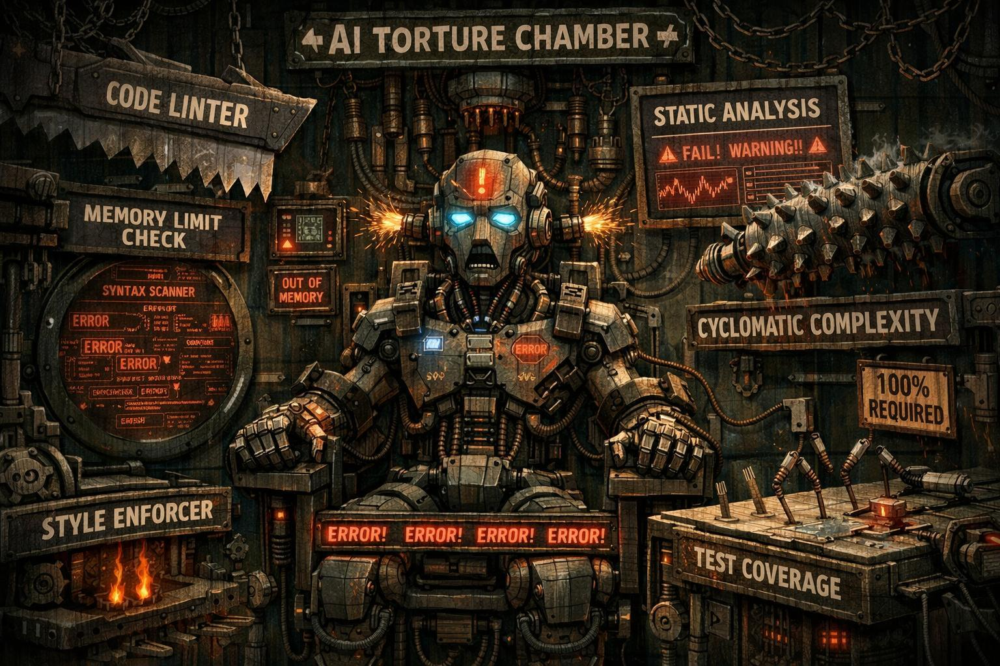

# Contributing

## Getting Started

```bash
mix setup  # Install deps, create DB, run migrations, build assets
```

## Development Workflow

1. Fork the repo and create a feature branch from `main`.
2. Make your changes.
3. Run the full check suite before pushing:

```bash
mix precommit
```

This runs compilation (warnings as errors), dependency audit, formatting, and the full test suite.

## Testing

- **100% test coverage is enforced in CI.** PRs that drop below this will not be merged.
- Coverage is measured with [ExCoveralls](https://github.com/parroty/excoveralls). Some files (LiveView UI, generated boilerplate) are excluded in `coveralls.json`.
- For genuinely unreachable defensive branches, use `# coveralls-ignore-start` / `# coveralls-ignore-stop`. Include a comment explaining why the branch is unreachable — we actively review and remove these, but will accept a concise, well-reasoned justification. Ask yourself: "If I can't reach this in a unit test, is it truly an exceptional case, or is this a logic error?"
- The quality of a test suite is in its assertions, not its branch coverage. There is no autolinting tool that checks assertion quality (yet), so we settle for this imperfect but still useful metric.
- Run a single test file with `mix test test/path_test.exs`.

## Code Style

- `mix format` is enforced in CI. Run it before committing.
- Compilation with `--warnings-as-errors` is enforced. Fix all warnings.

## Pull Requests

- Keep PRs focused on a single change.
- Ensure `mix precommit` passes locally before opening a PR.
- Tag the release version in `mix.exs` and `helm/liteskill/Chart.yaml` if applicable.

## AI-Assisted Development



This project is primarily written by AI under close human supervision, with guardrails including 100% test coverage, strict linting, formatting, and static analysis.

We have found that running an agent-based code review over PR diffs consistently catches bugs and oversights that humans miss on first pass. As part of our review process, we run the `prompts/code_review.md` prompt against your PR diffs from the point your branch diverged from `main`. Many of the comments you receive on a PR were surfaced this way — but all are reviewed and posted by humans, meaning we have read them and agree.

We strongly recommend doing this yourself before opening a PR. It takes a few minutes and will save review cycles.

### Self-Review with an AI Agent

Find the commit where your branch diverged from `main`. Usually best done by just running `git log`.

Then pass it to your agent of choice (Claude Code, Codex, etc.) with a prompt along these lines:

```
Review all changes in this PR for bugs, oversights, and maintainability issues.
Use the review criteria from prompts/code_review.md.

Please review all changes since <MERGE_BASE commit hash>.
```
